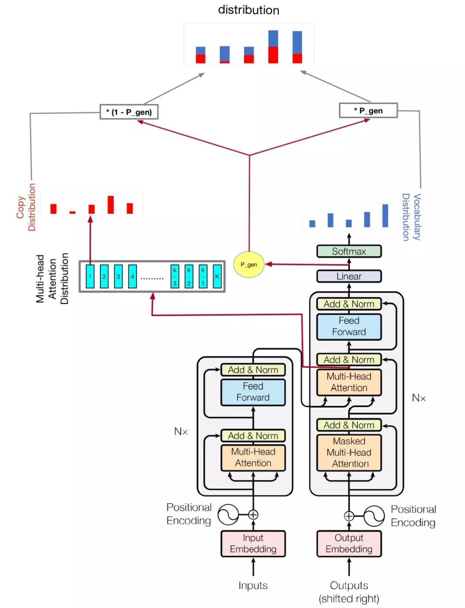
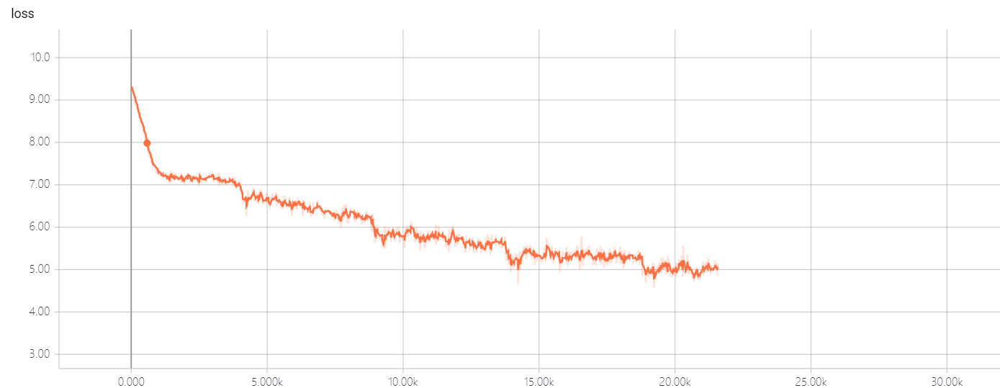

# A Abstractive Summarization Implementation with Transformer and Pointer-generator
when I wanted to get summary by neural network, I tried many ways to generate abstract summary, but the result was not good.
when I heared 2018 byte cup, I found some information about it, and the champion's solution attracted me, but I found some websites,
like github gitlab, I didn't find the official code, so I decided to implement it.

## Requirements
* python==3.x (Let's move on to python 3 if you still use python 2)
* tensorflow==1.12.0
* tqdm>=4.28.1
* jieba>=0.3x
* sumeval>=0.2.0

## Model Structure
### Based
My model is based on [Attention Is All You Need](https://arxiv.org/abs/1706.03762) and [Get To The Point: Summarization with Pointer-Generator Networks](https://arxiv.org/abs/1704.04368)
### Change
* The pointer-generator model has two mechanisms, which are **copy mechanism** and **coverage mechanism**, I found some materials, 
they show the Coverage mechanism doesn't suit short summary, so I didn't use this mechanism, just use the first one.
* Pointer generator model has a inadequacy, which can let the loss got nan, I tried some times and wanted to fix it,
but the result was I can't, I think the reason was when calculate final logists, it will 
 extend vocab length to oov and vocab length, it will get more zeroes. so I delete the mechanism of extend final logists, just use their mechanism of 
deocode from article and vocab. there is more [detail](https://github.com/abisee/pointer-generator/issues/4) about it, 
in this model, I just use word than vocab, this idea is from bert.
### Structure


## Training
* STEP 1. [download](https://pan.baidu.com/s/1szq0Wa60AS5ISpM_SNPcbA) the dataset, pwd is ayn6, the dataset is LCSTS by pre processed, so you will see very different dataset structure with LCSTS in the file
each line is abstract and article, they split by **","**, if you worry the amount of the dataset is different between my and LCSTS, don't 
worry, the amout of the dataset is same as LCSTS. 
* STEP 2. Run the following command.
```
python train.py
```
Check `hparams.py` to see which parameters are possible. For example,
```
python train.py --logdir myLog --batch_size 32 --train myTrain --eval myEval
```
My code also improve multi gpu to train this model, if you have more than one gpu, just run like this
```
python train.py --logdir myLog --batch_size 32 --train myTrain --eval myEval --gpu_nums=myGPUNums
```

| name | type | detail |
|--------------------|------|-------------|
vocab_size | int | vocab size
train | str | train dataset dir
eval | str| eval dataset dir
test | str| data for calculate rouge score
vocab | str| vocabulary file path
batch_size | int| train batch size
eval_batch_size | int| eval batch size
lr | float| learning rate
warmup_steps | int| warmup steps by learing rate
logdir | str| log directory
num_epochs | int| the number of train epoch
evaldir | str| evaluation dir
d_model | int| hidden dimension of encoder/decoder
d_ff | int| hidden dimension of feedforward layer
num_blocks | int| number of encoder/decoder blocks
num_heads | int| number of attention heads
maxlen1 | int| maximum length of a source sequence
maxlen2 | int| maximum length of a target sequence
dropout_rate | float| dropout rate
beam_size | int| beam size for decode
gpu_nums | int| gpu amount, which can allow how many gpu to train this model， default 1
### Note
Don't change the hyper-parameters of transformer util you have good solution, it will let the loss can't go down! if you have good solution, I hope you can tell me.

## Evaluation
### Loss
* Transformer-Pointer generator

* Transformer 

As you see, transformer-pointer generator model can let the loss go down very quickly!

## If you like it, and think it useful for you, hope you can star.